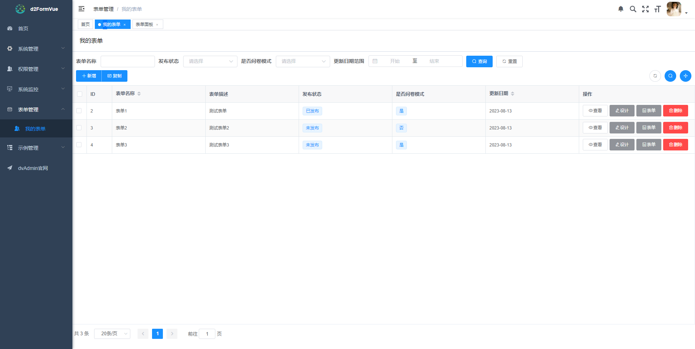

# d2Form
Python版简易问卷表单平台，基于django-vue-admin、d2-crud-plus、ng-form-element（vue2版本）等开源项目，采用python3.8.10+django2+vue2+celery+mysql8+redis，未来计划升级至vue3+django4。

## 安装方式
### 安装要求
- CPU >= 2 Core
- RAM >= 4GB
- 3306 8081 8082端口空闲
- Linux
- Docker 
### 快速启动
1. 安装git、docker、docker-compose。
2. 清理docker缓存，清理命令 docker builder prune。
3. git命令拉取项目源码至服务器本地，确保运行目录上存在docker-compose.yaml、Dockerfile、mysql8/*、fronted/.env.production等文件。
4. 确定服务启动要使用的域名或者服务器IP地址，修改fronted/.env.production文件，将“VUE_APP_BASE_API = 'http://127.0.0.1:8082/api'”，修改为“VUE_APP_BASE_API = 'http://域名或者服务IP地址:8082/api'”。
5. 执行docker compose up -d，进行初始化构建和启动应用，后续使用docker compose down关闭应用、docker compose up -d启动应用。
6. 访问http://域名或者服务IP地址:8082，管理员账号admin，密码123456 。
## 运行截图



## Issues
- django2.2不兼容mysql问题

将django\db\backends\mysql\operations.py中的query = query.decode(errors='replace')修改为query = query.encode(errors='replace') 。

- windows系统如何调试celery

需要安装eventlet，启动celery work服务时，使用-P eventlet参数，详见startcelery.bat脚本。

- mysql8建库要求

Character set: utf8mb4，Collation: utf8mb4_general_ci 。

- 依赖包注意事项

代码调试前，需要将source目录中的extra_apps.zip解压至项目根目录；
如果npm无法在线安装@linzhengtian/ng-form-element，可以直接安装source目录中的linzhengtian-ng-form-element-1.1.6.tgz文件；
本项目中使用到的ng-form-element源码位于source目录中的ng-form-element.zip文件，源码打包命令为npm pack 。

- 如何调试代码

前端代码位于fronted文件夹，安装和调试步骤详见目录下的README.md，后端代码安装调试步骤如下：
```
# mysql建库d2form
# 创建python虚拟环境，安装依赖
pip install -r requirements.txt
# 初始化数据库
python manage.py migrate
python manage.py init
# 配置redis
# 启动工程
python manage.py runserver 0.0.0.0:8000
```